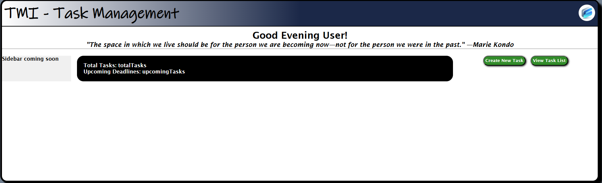

#Prototype of Task Manager-inator
---
This document serves to describe the functionality of the prototype. The functionality being displayed is reflective of User Story 3, the ability of a user to add a new task to the task list to track their work.
---

##Image 1

###Image 1 displays the home screen. This is a placeholder dashboard that resembles what the user will see when they have logged in or registered with the application.

---

##Image 2

###Image 2 displays the task list. This is a placeholder task list that displays tasks currently held by the user. Some information is displayed for each task and basic filters allow sorting of the tasks.

---

##Image 3

###Image 3 displays the create task form. This is a placeholder form that allows the user to input data for a new task. Dropdown boxes allow the user to select from pre-filled options. Input is validated before being accepted.

---

##Image 4

###Image 4 displays the task list with the new task created. This displays the functionality of creating a task and adding it's details to the task list.

---

This concludes the protype demonstration of User Story Case 3.

